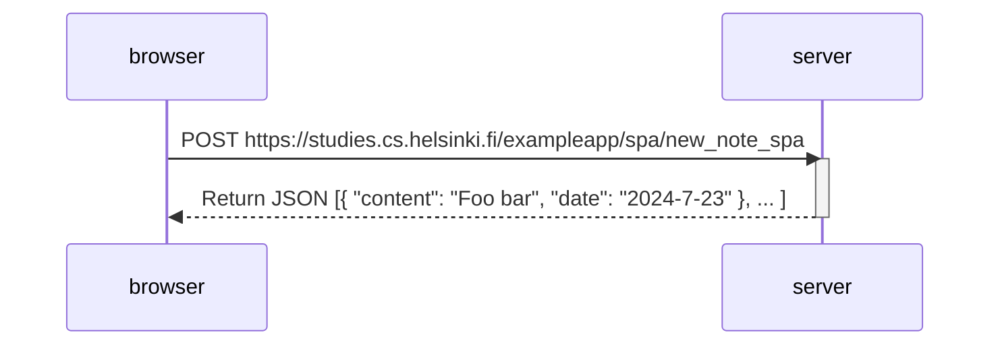

# 0.6: uusi muistiinpano

```mermaid
sequenceDiagram
    participant browser
    participant server
    
    browser->>server: POST https://studies.cs.helsinki.fi/exampleapp/spa/new_note_spa
    activate server
    server-->>browser: Return JSON [{ "content": "Foo bar", "date": "2024-7-23" }, ... ]
    deactivate server
```
